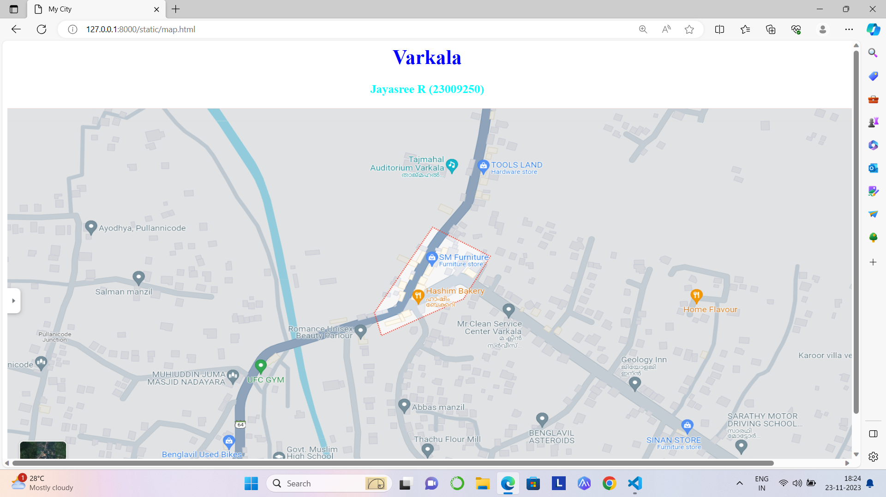
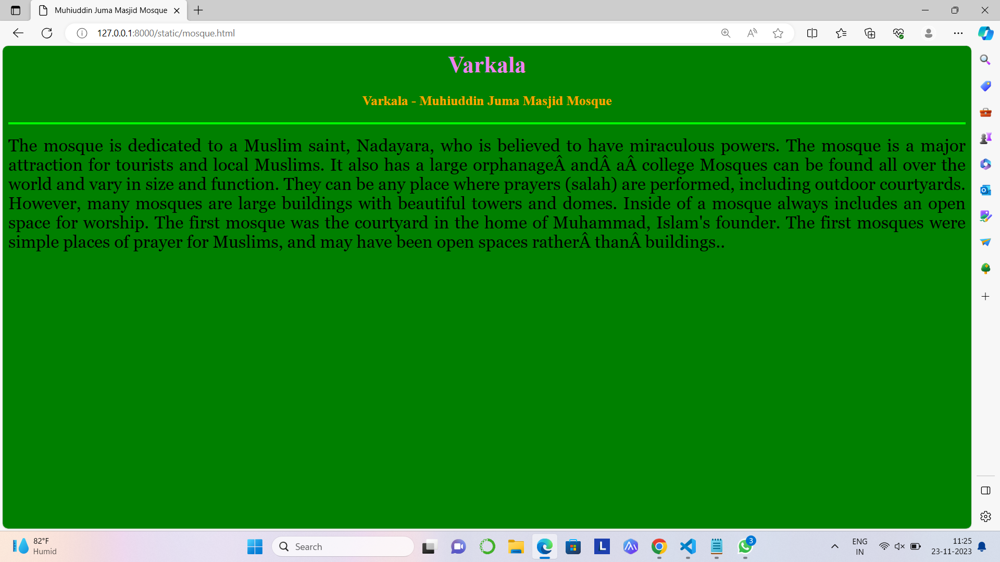

# Ex04 Places Around Me
## Date: 23.11.2023

## AIM
To develop a website to display details about the places around my house.

## DESIGN STEPS

### STEP 1
Create a Django admin interface.

### STEP 2
Download your city map from Google.

### STEP 3
Using ```<map>``` tag name the map.

### STEP 4
Create clickable regions in the image using ```<area>``` tag.

### STEP 5
Write HTML programs for all the regions identified.

### STEP 6
Execute the programs and publish them.

## CODE
```
map.html

<html>
<head>
<title>My City</title>
</head>
<body>
<h1 align="center">
<font color="blue"><b>Varkala</b></font>
</h1>
<h3 align="center">
<font color="cyan"><b>Jayasree R (23009250)</b></font>
</h3>
<center>

<map name="MyCity">
<area shape="rect" coords="550,250,750,400" href="home.html" title="My Home Town">
<area shape="circle" coords="300,400,60" href="mosque.html" title="Muhiuddin Juma Masjid Mosque">
<area shape="circle" coords="1100,300,60" href="restaurant.html" title="Home Flavour Restaurant">
<area shape="circle" coords="500,350,25" href="parlour.html" title="Romance Unisex Beauty Parlour">
<area shape="circle" coords="350,400,60" href="GYM.html" title="UFC GYM">
</map><datagrid></datagrid>
</center>
</body>
</html>

home.html

<html>
<head>
<title>Nadayara</title>
</head>
<body bgcolor="orange">
<h1 align="center">
<font color="pink"><b>Varkala</b></font>
</h1>
<h3 align="center">
<font color="lime"><b>Varkala - Nadayara</b></font>
</h3>
<hr size="3" color="white"> 
<p align="justify">
<font face="Georgia" size="5">
    Nadayara is a small Village/hamlet in Varkala Block in Thiruvananthapuram District of Kerala State, India. It 
    comes under Manamboor Panchayath. It belongs to South Kerala Division . It is located 45 KM towards North from 
    District head quarters Thiruvananthapuram. 4 KM from Varkala. 45 KM from State capital Thiruvananthapuram
    Nadayara Pin code is 695145 and postal head office is Sreenivasapuram .
    Edava ( 3 KM ) , Chemmaruthy ( 4 KM ) , Vettoor ( 5 KM ) , Cherunniyoor ( 5 KM ) , Ottoor ( 6 KM ) are the nearby
    Villages to Nadayara. Nadayara is surrounded by Ithikkara Block towards North , Chirayinkeezhu Block towards South,
    Kilimanoor Block towards East , Mukhathala Block towards North .
    Varkala , Paravoor , Attingal , Kollam are the near by Cities to Nadayara.</font>
</p>
</body>
</html>

mosque.html

<html>
<head>
<title>Muhiuddin Juma Masjid Mosque</title>
</head>
<body bgcolor="green">
<h1 align="center">
<font color="violet"><b>Varkala</b></font>
</h1>
<h3 align="center">
<font color="orange"><b>Varkala - Muhiuddin Juma Masjid Mosque</b></font>
</h3>
<hr size="3" color="lime"> 
<p align="justify">
<font face="Georgia" size="5">
     The mosque is dedicated to a Muslim saint, Nadayara, who is believed to have miraculous powers. The mosque is 
     a major attraction for tourists and local Muslims. 
     It also has a large orphanage and a college
     Mosques can be found all over the world and vary in size and function. 
    They can be any place where prayers (salah) are performed, including outdoor courtyards. 
    However, many mosques are large buildings with beautiful towers and domes. Inside of a mosque always includes an open 
    space for worship. 
    The first mosque was the courtyard in the home of Muhammad, Islam's founder. The first mosques were simple places of 
    prayer for Muslims, and may have been open spaces rather than buildings..</font>
</p>
</body>
</html>

restaurant.html

<html>
<head>
<title>Home Flavour Restaurant</title>
</head>
<body bgcolor="yellow">
<h1 align="center">
<font color="blue"><b>Varkala</b></font>
</h1>
<h3 align="center">
<font color="green"><b>Varkala - Home Flavour Restaurant</b></font>
</h3>
<hr size="3" color="white"> 
<p align="justify">
<font face="Georgia" size="5">
    Home Flavour Restaurant in varkala, Varkala, Thiruvananthapuram is a top player in the category South Indian Delivery
    Restaurants in the Varkala, Thiruvananthapuram. This well-known establishment acts as a one-stop destination servicing
    customers both local and from other parts of Varkala, Thiruvananthapuram. Over the course of its journey, this business
    has established a firm foothold in it's industry. The belief that customer satisfaction is as important as their products 
    and services, have helped this establishment garner a vast base of customers, which continues to grow by the day. This 
    business employs individuals that are dedicated towards their respective roles and put in a lot of effort to achieve the 
    common vision and larger goals of the company. In the near future, this business aims to expand its line of products and 
    services and cater to a larger client base. In Varkala, Thiruvananthapuram, this establishment occupies a prominent location
    is in varkala. It is an effortless task in commuting to this establishment as there are various modes of transport readily  
    available. It is known to provide top service in the following
    categories: Restaurants, Home Delivery Restaurants, South Indian Restaurants, North Indian Restaurants, Biryani Delivery 
    Restaurants, South Indian Delivery Restaurants, Indian Delivery Restaurants.</font> 
</p>
</body>
</html>

parlour.html

<html>
<head>
<title>Romance Unisex Beauty Parlour</title>
</head>
<body bgcolor="pink">
<h1 align="center">
<font color="cyan"><b>Varkala</b></font>
</h1>
<h3 align="center">
<font color="blue"><b>Varkala - Romance Unisex Beauty Parlour</b></font>
</h3>
<hr size="3" color="yellow"> 
<p align="justify">
<font face="Georgia" size="5">
    As of my last knowledge update in January 2022, I don't have specific information about a unisex beauty parlor 
    named "Romance" in Nadayara or any related details. It's possible that this business has opened or gained prominence
    after that date, or it may be a local establishment that doesn't have widespread recognition.
    To find information about the Romance Unisex Beauty Parlour in Nadayara, I recommend checking local directories, online
    reviews, or contacting local residents who may be familiar with businesses in the area. You can also try searching online 
    platforms, social media, or the business's official website for the most up-to-date information.
    Keep in mind that the availability of information might vary, and it's always a good idea to verify details directly with
    the business or through reliable local sources.</font>
</p>
</body>
</html>        

GYM.html

<html>
<head>
<title>UFC GYM</title>
</head>
<body bgcolor="lime">
<h1 align="center">
<font color="blue"><b>Varkala</b></font>
</h1>
<h3 align="center">
<font color="red"><b>Varkala - UFC GYM</b></font>
</h3>
<hr size="3" color="white"> 
<p align="justify">
<font face="Georgia" size="5">
    UFC GYM is a fitness brand that combines mixed martial arts and fitness. It was founded in 2009 as a brand extension of the 
    Ultimate Fighting Championship (UFC). UFC GYM's goal is to make the training programs and benefits of MMA athletes available
     to everyone.
     UFC GYM offers: 
     Learning spaces: For combat sports, including boxing, wrestling, and martial arts
     The Octagon: The UFC's famous eight-sided MMA cage
     Youth programs: To help kids develop athletic and motivational skills.</font>
</p>
</body>
</html>

```

## OUTPut





## RESULT
The program for implementing image maps using HTML is executed successfully.
